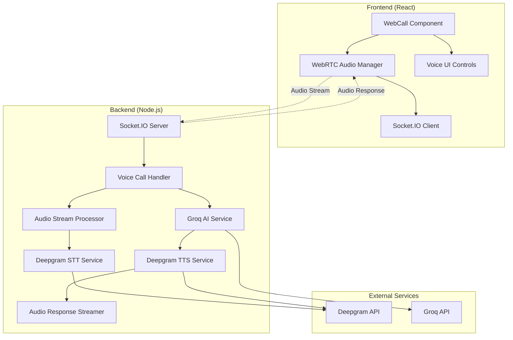
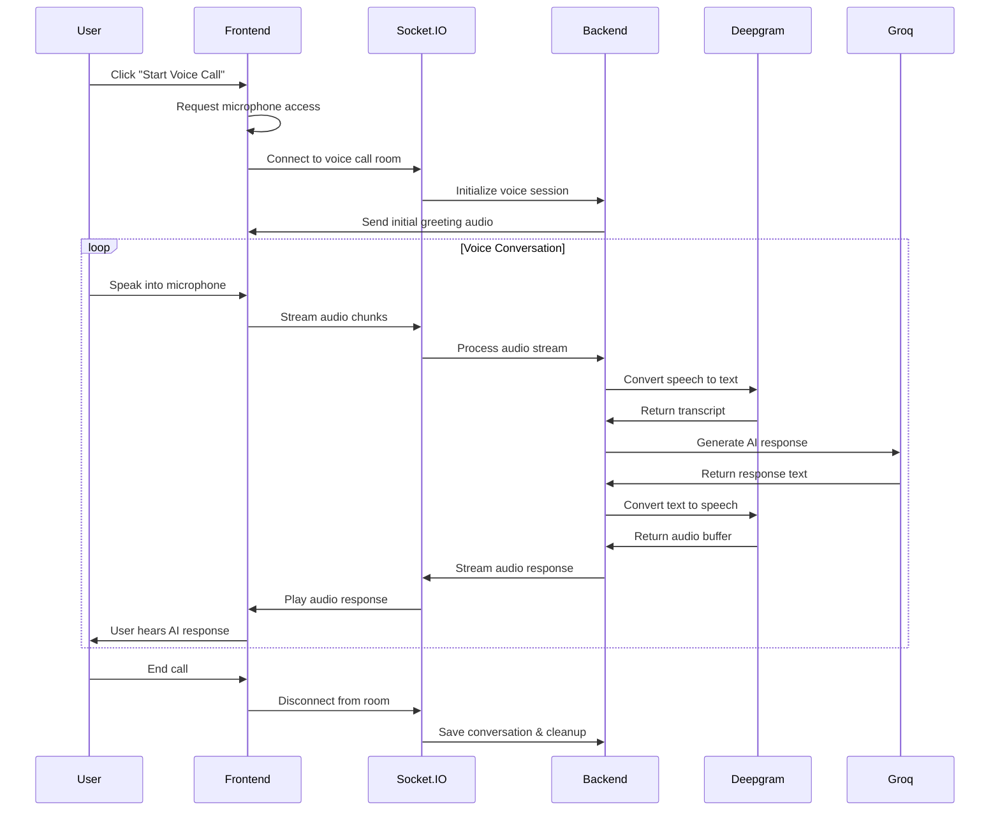

# Real-Time Voice Communication Design Document

## Overview

This design document outlines the implementation of real-time voice communication for VoxFlow's web call feature. The solution transforms the current text-based chat interface into a seamless voice conversation experience using WebRTC for audio streaming, WebSockets for real-time communication, Deepgram for speech processing, and Groq for AI responses.

The architecture leverages the existing Socket.IO infrastructure and integrates with current Deepgram and Groq services to provide low-latency, high-quality voice interactions that mirror the experience of phone calls.

## Architecture

### High-Level Architecture



### Real-Time Communication Flow



## Components and Interfaces

### Frontend Components

#### 1. VoiceCallManager
**Purpose**: Manages WebRTC audio streams and real-time communication

**Key Methods**:
- `initializeAudioStream()`: Set up microphone access and audio processing
- `startVoiceCall(agentId)`: Begin real-time voice session
- `sendAudioChunk(audioData)`: Stream audio to backend
- `playAudioResponse(audioBuffer)`: Play AI voice response
- `endVoiceCall()`: Clean up streams and save conversation

**State Management**:
- `isCallActive`: Boolean indicating active voice call
- `isMuted`: Microphone mute state
- `isProcessing`: AI processing indicator
- `audioLevel`: Real-time audio level for visual feedback
- `connectionStatus`: WebSocket connection health

#### 2. VoiceUI Component
**Purpose**: Provides voice call user interface and controls

**Features**:
- Large start/end call button with visual states
- Real-time audio level visualization
- Mute/unmute toggle
- Volume control for AI voice
- Connection status indicator
- Processing/speaking indicators

#### 3. AudioProcessor
**Purpose**: Handles client-side audio processing and streaming

**Capabilities**:
- Voice Activity Detection (VAD)
- Audio chunking for streaming
- Noise suppression and echo cancellation
- Audio format conversion (WebM to PCM)
- Real-time audio level monitoring

### Backend Components

#### 1. VoiceCallHandler
**Purpose**: Orchestrates real-time voice call sessions

**Socket Events**:
- `voice-call-start`: Initialize voice session
- `audio-chunk`: Process incoming audio stream
- `voice-call-end`: Terminate session and save data
- `audio-response`: Send AI voice response to client

**Key Methods**:
- `handleVoiceCallStart(socket, data)`: Set up voice session
- `processAudioChunk(socket, audioData)`: Handle streaming audio
- `generateAIResponse(transcript, context)`: Coordinate AI response
- `streamAudioResponse(socket, audioBuffer)`: Send voice response

#### 2. AudioStreamProcessor
**Purpose**: Manages real-time audio stream processing

**Features**:
- Audio buffer management
- Stream chunking and reassembly
- Format conversion (WebM to WAV)
- Audio quality optimization
- Memory management for concurrent streams

#### 3. VoiceSessionManager
**Purpose**: Manages voice call sessions and state

**Responsibilities**:
- Session lifecycle management
- Conversation context tracking
- Audio recording and storage
- Transcript generation
- Token usage calculation

### External Service Integrations

#### 1. Enhanced Deepgram Integration

**Real-Time STT**:
```javascript
// Live transcription with streaming
const liveTranscription = deepgram.listen.live({
  model: 'nova-3-general',
  language: 'en',
  smart_format: true,
  punctuate: true,
  interim_results: true,
  endpointing: 300 // End of speech detection
});
```

**Streaming TTS**:
```javascript
// Real-time text-to-speech
const ttsResponse = await deepgram.speak.request(
  { text: aiResponse },
  {
    model: 'aura-2-helena-en',
    encoding: 'mp3',
    container: 'mp3',
    sample_rate: 24000
  }
);
```

#### 2. Groq Streaming Integration

**Streaming AI Responses**:
```javascript
// Stream AI responses for faster perceived response time
const stream = await groq.chat.completions.create({
  messages: conversationHistory,
  model: 'llama-3.3-70b-versatile',
  stream: true,
  temperature: 0.7
});
```

## Data Models

### VoiceCallSession
```javascript
{
  id: 'uuid',
  runId: 'uuid',
  userId: 'uuid',
  agentId: 'uuid',
  status: 'active' | 'ended' | 'error',
  startTime: 'timestamp',
  endTime: 'timestamp',
  audioQuality: {
    sampleRate: 24000,
    bitRate: 128,
    codec: 'mp3'
  },
  metrics: {
    totalDuration: 'seconds',
    speechDuration: 'seconds',
    processingLatency: 'milliseconds',
    audioDropouts: 'count'
  }
}
```

### VoiceMessage
```javascript
{
  id: 'uuid',
  sessionId: 'uuid',
  role: 'user' | 'assistant',
  content: 'string', // Transcript text
  audioUrl: 'string', // Audio file URL
  timestamp: 'timestamp',
  duration: 'seconds',
  confidence: 'float', // STT confidence score
  processingTime: 'milliseconds'
}
```

### AudioChunk
```javascript
{
  sessionId: 'uuid',
  chunkId: 'uuid',
  audioData: 'base64', // Audio data
  format: 'webm' | 'wav' | 'mp3',
  sampleRate: 'number',
  timestamp: 'timestamp',
  isEndOfSpeech: 'boolean'
}
```

## Error Handling

### Client-Side Error Handling

1. **Microphone Access Denied**
   - Display clear permission request dialog
   - Provide fallback to text-based chat
   - Show browser-specific permission instructions

2. **WebSocket Connection Issues**
   - Automatic reconnection with exponential backoff
   - Connection status indicators
   - Graceful degradation to HTTP polling

3. **Audio Processing Errors**
   - Audio quality warnings
   - Automatic format fallbacks
   - Buffer overflow protection

### Server-Side Error Handling

1. **Deepgram API Failures**
   - Retry logic with exponential backoff
   - Fallback to alternative STT/TTS providers
   - Error logging and monitoring

2. **Groq API Failures**
   - Response timeout handling
   - Fallback to cached responses
   - Graceful error messages

3. **Memory Management**
   - Audio buffer size limits
   - Automatic cleanup of inactive sessions
   - Memory usage monitoring

## Testing Strategy

### Unit Tests

1. **Audio Processing Tests**
   - Audio format conversion accuracy
   - Buffer management under load
   - Voice activity detection precision

2. **Service Integration Tests**
   - Deepgram STT/TTS accuracy
   - Groq response generation
   - Error handling scenarios

3. **WebSocket Communication Tests**
   - Message delivery reliability
   - Connection handling
   - Room management

### Integration Tests

1. **End-to-End Voice Flow**
   - Complete voice conversation simulation
   - Audio quality validation
   - Latency measurements

2. **Concurrent Session Tests**
   - Multiple simultaneous voice calls
   - Resource usage monitoring
   - Performance degradation testing

3. **Error Recovery Tests**
   - Network interruption handling
   - Service failure recovery
   - Data consistency validation

### Performance Tests

1. **Latency Benchmarks**
   - Speech-to-response time measurement
   - Audio streaming delay testing
   - Network condition simulation

2. **Load Testing**
   - Concurrent user capacity
   - Memory usage under load
   - CPU utilization monitoring

3. **Audio Quality Tests**
   - Speech recognition accuracy
   - Voice synthesis quality
   - Audio compression efficiency

## Security Considerations

### Audio Data Protection

1. **Data Encryption**
   - WebSocket connections over WSS
   - Audio data encryption in transit
   - Secure audio file storage

2. **Privacy Controls**
   - User consent for audio recording
   - Automatic audio data deletion policies
   - GDPR compliance for voice data

3. **Access Control**
   - Authenticated WebSocket connections
   - Session-based audio access
   - Rate limiting for voice calls

### API Security

1. **Service Authentication**
   - Secure API key management
   - Request signing for external services
   - Token-based authentication

2. **Input Validation**
   - Audio data format validation
   - Content filtering for transcripts
   - Malicious audio detection

## Performance Optimization

### Audio Streaming Optimization

1. **Adaptive Quality**
   - Dynamic audio quality adjustment
   - Network condition monitoring
   - Bandwidth-based codec selection

2. **Buffer Management**
   - Optimal buffer sizes for low latency
   - Predictive buffering strategies
   - Memory-efficient audio processing

3. **Compression Strategies**
   - Real-time audio compression
   - Lossless vs lossy trade-offs
   - Streaming-optimized formats

### Service Optimization

1. **Caching Strategies**
   - TTS response caching for common phrases
   - AI response caching for similar queries
   - Audio file CDN distribution

2. **Connection Pooling**
   - Persistent connections to external APIs
   - Connection reuse optimization
   - Load balancing strategies

3. **Resource Management**
   - CPU-intensive task queuing
   - Memory usage optimization
   - Garbage collection tuning